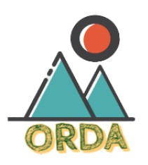

# ORDA

- 깃허브 저장소 주소: https://github.com/5rda/orda
- 조원: 장하늬, 김규리, 임성주, 6회차_정세호, 최지원
- 팀 번호: 5
- 팀명: 5르다
- 활용된 기술: AWS, Bootstrap, CSS, Django, Figma, GitHub, HTML, JavaScript, Nginx, Notion, PostGIS, PostgreSQL, Python, QGIS, Tailwind CSS

## 1. Team

---

## ORDA

- 팀명: 5르다
- 팀원
    - 백엔드
        - 장하늬(팀장)
        - 김규리
        - 임성주
    - 프론트엔드
        - 정세호
        - 최지원

 

## 2. Project

### 프로젝트 소개

---

**누구나 등산을 즐길 수 있도록 당신에게 맞는 길을 찾아주는 당신의 산 친구, “오르다”**

**ORDA에서는,**

- 지역과 원하는 테마를 선택하면 나에게 딱 맞는 산과 코스를 고를 수 있습니다.
- 산과 코스에 대한 상세한 정보와 난이도를 제공하여 안전한 등산을 도와줍니다.
- 실시간 날씨 정보와 관련 뉴스를 제공하여 등산 일정을 효율적으로 계획할 수 있습니다.
- 다녀온 산과 코스를 기록하고 소중한 추억을 쌓을 수 있습니다.
- 커뮤니티 기능을 통해 새로운 친구를 만들고, 등산에 대한 지식과 경험을 공유할 수 있습니다.

"오르다"는 당신의 등산 경험을 더욱 풍요롭게 만들어줄 신뢰할 수 있는 동반자입니다. 등산을 좋아하는 사람들을 위해 최적의 경로를 찾아주고, 다양한 기능을 통해 등산 여정을 기록하고 공유할 수 있습니다.

산의 아름다움을 탐험하고, 자연과 조화롭게 소통하며, 당신만의 등산 이야기를 만들어가는 데 "오르다"가 함께 하겠습니다.

### DB Schema

---

[A Free Database Designer for Developers and Analysts](https://dbdiagram.io/d/646db5d1dca9fb07c4a9173a)

### 기능별 화면

---

- 로그인
    - 소셜 로그인(카카오, 네이버) 포함
    - 로그인시 유저가 보고 있던 이전 페이지로 이동
    
    
    
- 산 탐색
    - 지역(시/군/구)과 태그로 필터링
    - 탐색 결과를 좋아요순, 리뷰순, 조회순, 고도순, 가나다순 정렬
    
    
    
    
    
- 100대 명산
    - 좋아요순, 리뷰순, 조회순, 고도순, 가나다순 정렬
    
    
    
- 산 상세정보
    - 산의 상세정보(산 이름, 지역, 고도, 소개글) 제공
    - 해당 산 관련 최신 뉴스 및 해당 지역의 날씨 정보 제공
    
    
    
- 날씨 페이지
    - 현재 시간 기준 5일 후까지의 날씨 정보 제공
    
    
    
- 등산 코스
    - 지역별 코스 필터링
    - 북마크순, 난이도순, 거리순, 소요시간순, 가나다순 정렬
    
    
    
- 코스 상세 리스트
    - 코스별 상세정보(코스명, 지도, 총거리, 소요시간, 난이도)
    - 코스별 경유지 표시(해제 가능)
    - 코스 GPX 파일 메일 전송
    
    
    
    
    
- 마이코스
    - 조회수가 많은 게시글 / 좋아요가 많은 게시글 / 전체 게시글
    
    
    
- 인증샷
    - 사진이 있는 게시글의 이미지만 조회
    
    
    
- 오른기억
    - 유저가 다녀온 코스 기록
    - 카카오맵에 산 커서 표시
    - 산 커서 클릭 시 각 산의 코스 조회
    - 하나 이상의 코스를 다녀온 산은 커서 변경
    - 각 코스 이름 클릭시 코스 상세정보 창 팝업
    - 코스 상세정보(코스명, 총거리, 소요시간, 난이도) 제공
    - 코스 GPX 파일 메일 전송
    
    
    
 

## 3. Members

### 👑 팀장: 장하늬

---

- Role : Team Leader
- Position : Backend
- Stack : Python, django, MySQL,  PostgreSQL, html, css, Js
- Works :
    1. 등산로 및 산 DB 구축
    2. 등산로 좌표 찍기
    3. 앱 mountains 기능 구축
        1. 산 상세 페이지
        2. 등산로 리스트 페이지
        3. 탐색 페이지
        4. 기타
    4. AWS 배포
- 프로젝트 후기 : 한 달 동안 새로운 기술 탐색, 습득, 적용의 반복이었습니다. GIS를 다뤄야 해서 다양한 프로그램을 써야했습니다. QGIS부터 postgreSQL, POSTGIS까지. 우여곡절도 많고 가끔 무리한 프로젝트 아니었을까? 했지만 결국 해냈다는 뿌듯함에 행복합니다 😊 이 맛에 프로젝트하는건가 싶네요.  AWS 배포를 급히하느라 네트워크적 지식을 허술하게 쌓아서 이 부분은 추후 보강하려고 합니다. 부족하고 못난 팀장, 말많고 징징대는 팀장 믿?고?(믿었다고 믿겠습니다!) 아무튼 끝까지 달려와주셔서 정말정말 감사합니다. 다른 분들께도 많은 걸 배웠어요 ㅎㅎ 그리고 프로젝트는 절대 혼자서 하는 게, 아닌 모두와 같이 하는 거란 걸 다시 한 번 깨닫는 시간이었습니다. 마지막으로 클라이언트 뒤에서 적절한 데이터를 선별하고 제공하는 백엔드 너무 좋습니다!

### 팀원: 김규리

---

- Role : Team Member
- Position : Backend
- Stack : Python, Django, HTML, CSS, JavaScript
- Works :
    1. accounts 앱 모델 작성 및 기능 구현
        1. 로그인(소셜로그인 포함) / 로그아웃
        2. 회원가입 / 회원정보 수정 / 비밀번호 변경 / 회원탈퇴
        3. 프로필 유저 레벨
        4. 오른기억
            1. 카카오맵 지도 생성 및 커서, 클러스터러 표현
    2. mountains 앱의 review 모델 작성 및 관련 기능 구현
        1. 산 리뷰 생성 / 수정 / 삭제
        2. 산 리뷰 좋아요
- 프로젝트 후기 :
    
    이번 프로젝트에서는 PostgreSQL을 사용했는데 처음 써보는 것이다 보니 팀원 모두가 같은 환경에서 일하기까지 우여곡절이 있었습니다. 그런데도 모두가 포기하지 않고 열심히 하는 모습을 보면서 저 또한 배우고 느낀 것이 많습니다. 소셜 로그인이나 카카오 지도 API 적용은 저로서는 처음 시도해 보는 것이었기 때문에 어렵기는 했지만, 완성된 결과물을 보니 뿌듯하기도 하고 하길 잘했다는 생각이 듭니다. 개발 과정에 ChatGPT를 많이 활용했는데 시간이 촉박하다 보니 GPT가 제시해 주는 방법이나 코드를 완전히 이해하고 활용하지는 못해서 그 점은 아쉽지만 앞으로 좀 더 공부를 열심히 해야겠다는 자극을 받았습니다. 마지막으로 함께 고생해 준 팀원분들께 감사함을 전합니다. 새로운 것에 끊임없이 도전하는 모습을 보며 스스로를 반성하고 돌아볼 수 있었습니다. 다들 너무 고생 많으셨고 정말 감사합니다! ♥
    

### 팀원: 임성주

---

- Role : Team Member
- Position : Backend
- Stack : Python, Django, JavaScript
- Works :
    1. Posts 앱
    2. 날씨 API
    3. 알림
- 프로젝트 후기 : 한달이라는 시간동안 첫번째, 두번째 프로젝트를 하면서 좋았던 점은 반영하고, 아쉬웠던 점을 보완하는 과정을 가지려고 계획했습니다. 그렇게 생각하면서 개선할 수 있었던 점도 있었지만, 또 다시 많이 부족하다는 것을 느꼈습니다. 다만 지난 한달을 돌아보며, 이걸 어떻게 했을까라는 생각이 들 정도로 신기한 부분들이 많이 있어 뿌듯함을 느꼈습니다. 또한 팀원분들께서 부족한 저와 함께 해주셔서 여기까지 왔다고 생각하며, 감사함과 죄송함이 크게 남습니다. 그 동안 제가 하는 것들에 벅참을 느껴서 제가 작성한 코드들도 천천히 돌아보지 못했는데, 끝난 후에라도 다시 한번 뒤돌아 보며 스스로 공부하는 시간을 가져야 할 것 같습니다. 느낀 점 중 가장 큰 하나는 계획의 중요성인데, 어떤 것이든 좀 더 치밀하게 계획을 세우고 실천해야겠다는 생각이 들었습니다. 다시 한번 부족한 저와 함께 해주신 팀원분들께 감사드립니다.

### 팀원: 정세호

---

- Role : Team Member
- Position : Frontend
- Stack : python, django, html, css, javascript, tailwind, bootstrap
- Works :
    1. accounts
        1. profile
    2. mountains
        1. detail (날씨, 뉴스 기능 구현)
        2. search
        3. weather
    3. posts
        1. index
        2. search
- 프로젝트 후기 :
    
    이번 프로젝트는 이전과 달리 다들 프로젝트 관리에 신경을 많이 써주셔서 큰 충돌 없이 프로젝트를 마무리 할 수 있었다는 부분이 좋았던 것 같습니다. 이번 프로젝트 역시 많은 것들을 배울 수 있었고 1, 2차 때보다 많은 기능들을 구현할 수 있어서 실력적으로 많이 늘었다고 생각하지만 한편으로는 gpt에게 의존하는 경우가 많다 보니 이게 내 실력이 맞는건가 의문이 들 때도 있었던거 같습니다. 프로젝트가 끝나면 gpt에게 의존하지 않도록 js와 python을 꾸준히 공부해야할 것 같습니다
    

### 팀원: 최지원

---

- Role : Team Member
- Position : Frontend
- Stack : HTML, stlye-components, Javascript, tailwind, bootstrap, python, django
- Works :
    1. main index
    2. nav, footer
    3. accounts: 오른 기억, 로그인, 회원 가입
    4. post 앱 전체 프론트(공동 포함)
    5. mountain앱 : course_all / course_detail / mountain_list / course_list
- 프로젝트 후기 :
    
    postgre를 다운 받은 것에 어려움이 있어, 계획에 차질이 있었지만 될 때 까지 묵묵히 기다려준 조원 분들이 있어서 큰일 없이 잘 마칠 수 있었습니다. 익숙하지 않은 툴에 모두 어려움이 있었지만, 서로 도와가며 잘 해결해나가는 모습이 보기 좋았었던 것 같습니다.
    
    오른 기억에서 지도 코드와 밑의 코드를 비동기로 연결 시키는 작업을 시간 안에 완성을 못해서, 이후 자바스크립트를 더 공부하며 연결 할 수 있도록 하고 싶습니다.